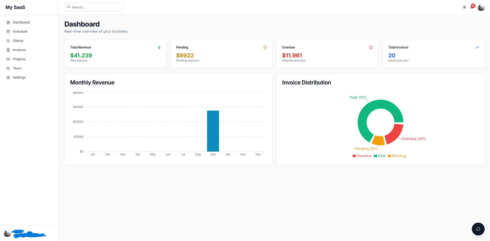
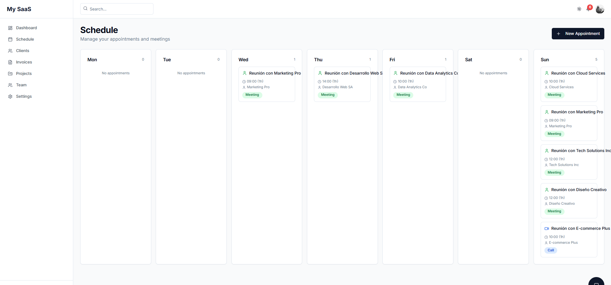
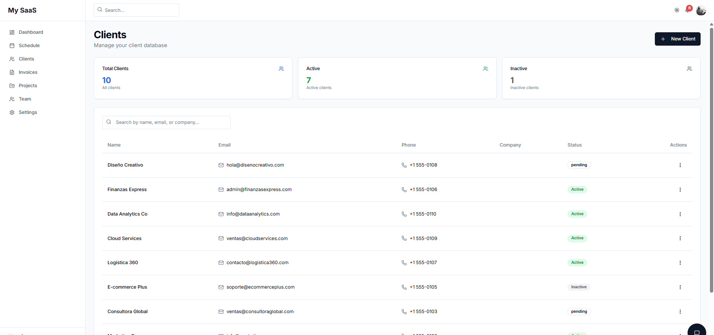
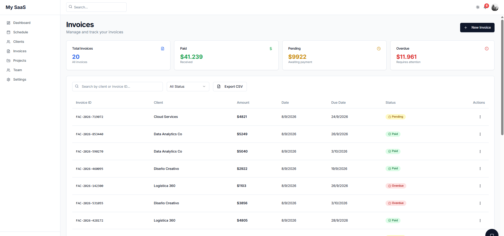
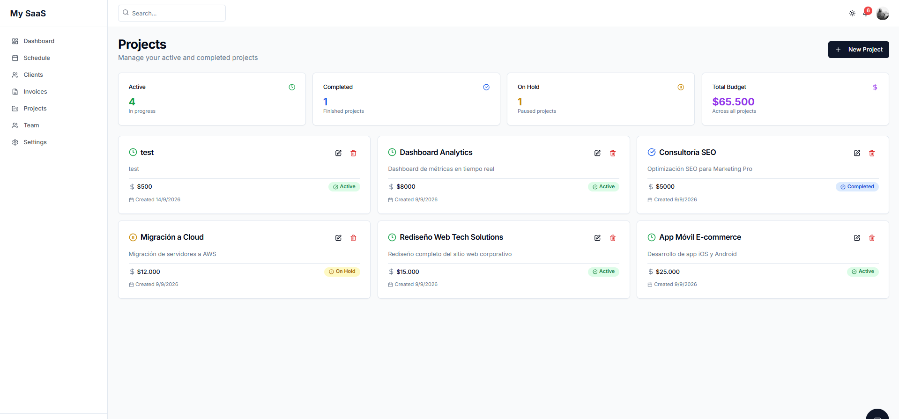
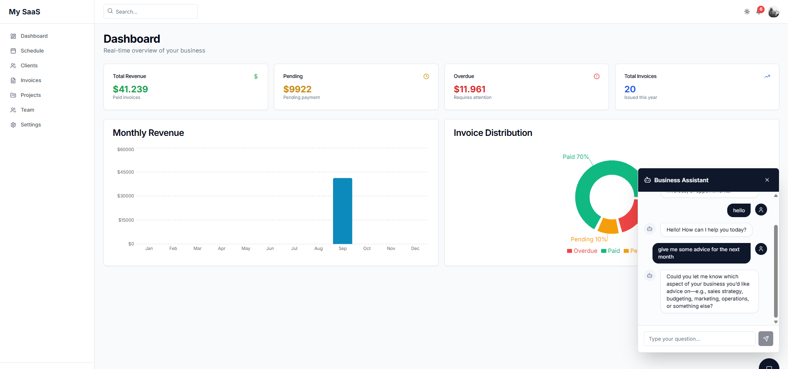

# My SaaS - Business Management Platform

A modern, full-stack SaaS application for managing clients, invoices, projects, appointments, and team collaboration. Built with Next.js 14, TypeScript, Prisma, and PostgreSQL.

## 🚀 Features

- **Dashboard** - Real-time analytics with charts (Bar & Pie) showing revenue, pending payments, and invoice distribution
- **Schedule** - Weekly calendar view to manage appointments and meetings
- **Clients** - Full client database with search, filtering, and status management
- **Invoices** - Create, edit, and track invoices with PDF generation and CSV export
- **Projects** - Track projects with budgets, status, and descriptions
- **Team** - Invite team members via email with role-based access control
- **Settings** - Business configuration and personal profile management
- **AI Assistant** - Chatbot powered by Groq API (Llama 3) for business insights
- **Authentication** - Secure login with NextAuth.js and JWT sessions
- **Dark/Light Mode** - Full theme support

## 📸 Screenshots

### Dashboard

### Schedule

### Clients

### Invoices

### Projects

### AI Assistant

## 🛠️ Tech Stack

### Frontend
- **Next.js 14** - React framework with App Router
- **TypeScript** - Type-safe development
- **Tailwind CSS** - Utility-first styling
- **shadcn/ui** - Beautiful, accessible UI components
- **Recharts** - Data visualization charts
- **Lucide React** - Icon library

### Backend
- **Next.js API Routes** - Serverless API endpoints
- **Prisma** - Type-safe ORM
- **PostgreSQL** - Relational database (via Neon)
- **NextAuth.js** - Authentication and session management

### AI & Integrations
- **Groq API** - Fast AI inference with Llama 3
- **Resend** - Email delivery for team invitations
- **UploadThing** - File uploads for avatars and attachments

## 📦 Installation

### Prerequisites
- Node.js 18+ and pnpm
- PostgreSQL database (or Neon free tier)
- Groq API key (free at console.groq.com)

## Setup

1. Clone the repository:

\`\`\`bash
git clone https://github.com/chavarriajosue866-hue/mi-saas.git
cd mi-saas
\`\`\`

2. Install dependencies:

\`\`\`bash
pnpm install
\`\`\`

3. Set up environment variables:

Create a `.env.local` file in `apps/web/` with:

\`\`\`bash
DATABASE_URL="postgresql://..."
NEXTAUTH_SECRET="your-secret-key"
NEXTAUTH_URL="http://localhost:3000"
GROQ_API_KEY="gsk_..."
RESEND_API_KEY="re_..."
UPLOADTHING_SECRET="..."
UPLOADTHING_APP_ID="..."
\`\`\`

4. Run database migrations:

\`\`\`bash
cd packages/db
pnpm prisma migrate deploy
\`\`\`

5. Start the development server:

\`\`\`bash
cd apps/web
pnpm dev
\`\`\`

6. Open [http://localhost:3000](http://localhost:3000) to see the application.

🎨 Key Features in Detail
1. Dashboard Analytics
- Real-time visualization of business metrics including:
- Total revenue (paid invoices)
- Pending payments
- Overdue invoices
- Monthly revenue trends
- Invoice status distribution
2. Invoice Management
- Create professional invoices with custom details
- Track payment status (Paid, Pending, Overdue)
- Generate PDF invoices for download
- Export all invoices to CSV for accounting
- Filter and search by client or status
3. AI Business Assistant
- Powered by Groq's Llama 3 model, the AI assistant can:
- Answer questions about your business
- Provide insights on clients and invoices
- Help with scheduling and planning
- Respond in context of your business data
4. Team Collaboration
- Invite team members via email
- Role-based access (Admin, Member)
  
Manage permissions and access levels
Deployment
Deploy to Vercel

The easiest way to deploy is using the Vercel Platform:
- Push your code to GitHub
- Import your repository in Vercel
- Configure environment variables
- Deploy!

Environment Variables for Production
Make sure to set all required environment variables in your Vercel dashboard.
📝 License
This project is licensed under the MIT License.
🤝 Contributing
Contributions, issues, and feature requests are welcome!
👨‍💻 Author
Built with ❤️ for freelancers and small businesses.
